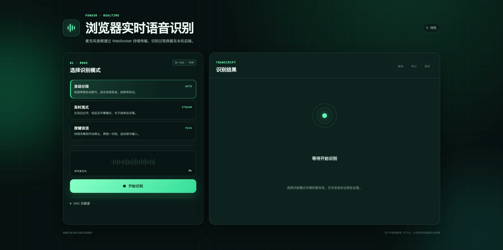

# FunASR Realtime · 浏览器实时语音识别


基于 FunASR 的全栈语音识别项目。浏览器负责麦克风采集和 16kHz PCM 转换，通过 WebSocket 与 FastAPI 后端保持长连接；后端按所选模式执行自动分段、实时流式或按键说话识别。

## 功能

- Vue 3 + TypeScript + Vite 前端
- AudioWorklet 浏览器麦克风采集，实时重采样为 16kHz 单声道 PCM
- FastAPI WebSocket 长连接，支持一个连接多次启动/停止识别
- 15 秒应用层心跳、10 秒超时检测和指数退避自动重连
- 服务端独立心跳接收任务，模型推理不会阻塞 `ping/pong`
- 三种识别模式：
  - `auto`：能量 VAD 自动断句 + Paraformer-zh 离线识别 + 中文标点
  - `stream`：`paraformer-zh-streaming` 边说边出临时结果
  - `push`：持续采集到手动停止，再统一识别并恢复标点
- 实时音量、连接状态、分段编号、识别延迟和识别文本展示
- 会话内说话人识别，结果标记为 `speaker_01`、`speaker_02`...
- 文本复制、清空、TXT 导出
- 保留原命令行麦克风识别入口
- 独立常驻模型服务：模型只加载一次，API 重启后直接复用
- 多客户端流式状态隔离、健康检查
- 前后端独立 Dockerfile 和 Docker Compose 一键部署

## 项目结构

```text
FunASR-test/
├── backend/
│   ├── app/
│   │   ├── api/
│   │   │   ├── protocol.py        # WebSocket 消息与 PCM 编解码
│   │   │   └── routes/
│   │   │       ├── asr.py         # /api/v1/asr/stream
│   │   │       └── system.py      # 健康检查、模式列表
│   │   ├── core/                  # 配置与日志
│   │   ├── services/
│   │   │   ├── asr.py             # 离线模型
│   │   │   ├── asr_streaming.py   # 流式模型和独立解码会话
│   │   │   ├── asr_session.py     # WebSocket 会话状态机
│   │   │   ├── audio_vad.py       # 浏览器 PCM 能量 VAD
│   │   │   └── model_registry.py  # 模型懒加载
│   │   ├── cli.py                 # 原 CLI
│   │   └── main.py                # FastAPI 入口
│   ├── scripts/preload_models.py # 构建镜像时预热模型缓存
│   ├── tests/
│   ├── Dockerfile
│   └── requirements.txt
├── frontend/
│   ├── public/pcm-capture-worklet.js
│   ├── src/
│   │   ├── components/
│   │   ├── composables/
│   │   ├── services/
│   │   └── types/
│   ├── package.json
│   ├── Dockerfile
│   ├── nginx.conf
│   └── vite.config.ts
├── docker-compose.yml
├── docs/protocol.md
├── main.py                        # CLI 兼容入口
├── pyproject.toml
├── Makefile
└── .env.example
```

## 环境要求

- Python 3.9–3.12
- Node.js 20.19+
- 浏览器：最新版 Chrome、Edge 或 Firefox
- 麦克风输入设备
- 首次识别会从 ModelScope 下载模型，离线模型约数百 MB

麦克风 API 只允许安全上下文使用。`localhost` 可直接开发；部署到其他域名时必须配置 HTTPS/WSS。

## 安装

```bash
# 创建 Python 虚拟环境
python3 -m venv .venv
source .venv/bin/activate

# 安装后端、CLI 和开发依赖
pip install -e ".[dev,cli]"

# 安装前端依赖
npm --prefix frontend install
```

也可以通过 Makefile：

```bash
make install
```

PyTorch 如需指定 CUDA/CPU 版本，请先按 [PyTorch 官方说明](https://pytorch.org/get-started/locally/) 安装，再执行项目安装命令。

## 开发运行

打开两个终端：

```bash
# 终端 1：后端，http://127.0.0.1:8000
make dev-backend

# 终端 2：前端，http://127.0.0.1:5173
make dev-frontend
```

浏览器打开 <http://localhost:5173>，选择识别模式，点击“开始识别”，然后允许麦克风权限。

Vite 会把 `/api`（包含 WebSocket）代理到 `http://127.0.0.1:8000`。需要修改后端地址时，复制 `.env.example` 为 `frontend/.env.local` 并配置 `VITE_API_TARGET`。

## 识别模式

| 模式 | 断句方式 | 模型 | 适用场景 |
|---|---|---|---|
| 自动分段 | 服务端能量 VAD 在静音后结束一句 | Paraformer-zh + FSMN-VAD + CT-Punc | 连续发言、会议记录 |
| 实时流式 | VAD 分句，句内 600ms 增量解码 | paraformer-zh-streaming | 实时字幕、低延迟交互 |
| 按键说话 | 点击停止后识别全部音频 | Paraformer-zh + CT-Punc | 短句、命令、录音转写 |

前端展开“识别设置”可调整 `auto` 和 `stream` 模式的能量阈值，并可开关说话人识别。
环境安静时调低能量阈值，噪声较大时调高。

## 说话人识别

说话人识别默认开启。每次开始识别独立编号：

前端“识别设置”中提供明确的“开启/关闭”开关；关闭后不会提取声纹，也不会显示说话人标签。

- 会话中第一个稳定说话人标记为 `speaker_01`
- 后续新说话人依次标记为 `speaker_02`、`speaker_03`...
- 识别结果会在前端显示说话人标签，复制和导出文本时也会带上 `[speaker_01]` 前缀

主要配置：

```env
FUNASR_SPEAKER_ENABLED=true
FUNASR_SPEAKER_MODEL=cam++
FUNASR_SPEAKER_SIMILARITY_THRESHOLD=0.70
FUNASR_SPEAKER_NEW_THRESHOLD=0.45
FUNASR_SPEAKER_SWITCH_MARGIN=0.08
FUNASR_SPEAKER_MIN_SEGMENT_SEC=0.8
FUNASR_SPEAKER_MAX_SPEAKERS=8
FUNASR_SPEAKER_EMBEDDING_WINDOW_SEC=1.5
FUNASR_SPEAKER_EMBEDDING_INTERVAL_SEC=0.8
```

- `auto` / `push`：每个识别片段分配一个说话人。
- `stream`：使用最近音频窗口每约 0.8 秒更新一次当前说话人，句末再用整句音频校正。
- `similarity_threshold` 用于确认同一说话人；`new_speaker_threshold` 以下的相似度才会新建说话人。
  两者之间的模糊区域优先归到已有说话人，避免同一人被拆成多个 ID。
- 默认首次使用时加载 CAM++ 模型，模型缺失时会先下载；加入
  `FUNASR_PRELOAD_MODELS=offline,streaming,speaker` 可以在常驻服务启动时一起预加载。
- 两个说话人重叠说话时无法可靠分配单一标签，需要专门的 diarization 模型。
- 当前编号只在单次 WebSocket 会话内稳定，不用于跨会话识别具体人员。
- WebSocket 自动重连或重新开始识别后，编号会重新从 `speaker_01` 开始。

### 声纹库与注册

页面“识别设置 → 声纹库”可以录入说话人姓名，并录音 3 秒完成注册。注册成功后：

- 声纹库中的说话人使用稳定 ID：`speaker_01`、`speaker_02`...
- 识别时优先匹配已注册声纹，匹配成功会显示 ID 和姓名，例如 `speaker_01 · 张三`。
- 未注册说话人在存在声纹库时使用 `unknown_01`、`unknown_02`...
- 同名再次注册会按样本数做加权中心向量更新，而不是创建重复记录。
- 注册时会按多个时间窗口提取 embedding，只保留彼此一致的声纹；如果音频里混入多人或噪声，
  会拒绝注册并要求重新录制。

声纹库默认保存在：

```text
~/.cache/funasr-realtime/speakers.sqlite3
```

注册在下次开始识别时生效。相关 REST API：

- `GET /api/v1/speakers`：列出已注册声纹
- `POST /api/v1/speakers/enroll?name=张三&sample_rate=16000`：注册声纹
  - Body 为 raw PCM，16kHz、单声道、`pcm_s16le`
  - 音频长度 1～60 秒
- `DELETE /api/v1/speakers/{speaker_id}`：删除声纹

声纹匹配阈值：

```env
FUNASR_SPEAKER_ENROLLED_MATCH_THRESHOLD=0.70
```

注册说话人没有被识别出来时，可以适当降低该阈值；不同注册人被误匹配时，可以提高该阈值。

## ASR 文本后处理

识别结果会经过一层保守后处理：

1. **纠错**：修正常见 ASR 错别字/同音词，例如“因该”→“应该”、“帐号”→“账号”。
2. **口语清洗**：只清理纯语气词和结巴重复，例如“嗯，我我我觉得”→“我觉得”。
   不会简单删除“然后、就是、这个、那个”等可能承载语义的口语词。
3. **断句**：优先按 `。！？；` 分句，过长时再按逗号切分，并把过短句子合并。

配置：

```env
FUNASR_ASR_POSTPROCESS=true
FUNASR_ASR_CLEAN_FILLERS=true
FUNASR_ASR_MAX_SENTENCE_CHARS=40
FUNASR_ASR_MIN_SENTENCE_CHARS=6
```

自定义纠错词表使用 JSON 对象：

```json
{
  "测是": "测试",
  "联习": "练习"
}
```

配置路径：

```env
FUNASR_ASR_CORRECTION_FILE=/path/to/corrections.json
```

## 模型常驻与预加载

后端默认使用独立的常驻模型服务。模型只在第一次启动常驻服务时加载到内存；之后 API 进程重启只会连接这个服务，不会再次加载权重。

```bash
# 启动 API；模型服务不存在时会自动在后台启动
make dev-backend

# 手动前台启动常驻模型服务（可选）
make model-daemon

# 显式重新加载常驻服务中的模型
make model-daemon-reload

# 启动 API 时强制重载常驻模型
make dev-backend-reload-models

# 停止常驻模型服务
make model-daemon-stop
```

`make model-daemon-reload` 会重建模型对象，执行前请先停止正在进行的识别会话。

需要回到旧的“模型跟随后端进程”模式时：

```bash
FUNASR_MODEL_DAEMON=off make dev-backend
```

`FUNASR_PRELOAD_MODELS` 控制常驻服务启动时预加载哪些模型：

- `offline`：Paraformer-zh、FSMN-VAD 和 CT-Punc
- `streaming`：paraformer-zh-streaming

```bash
FUNASR_PRELOAD_MODELS=offline,streaming
FUNASR_PRELOAD_STRICT=true
```

- 设置为空字符串时，首次识别请求再懒加载；加载后常驻服务会一直复用。
- `FUNASR_PRELOAD_STRICT=true` 时，任一模型加载失败都会阻止常驻服务启动。
- 模型文件缓存默认由 ModelScope 管理，只有文件缺失时才需要重新下载。
- 常驻服务默认监听 `127.0.0.1:8765`，日志默认在
  `~/.cache/funasr-realtime/model-daemon.log`。
- 默认只驻留 `offline` / `streaming` 中的一个 ASR 模型，切换模式时自动释放另一个，避免
  Intel Mac 等内存较小机器同时加载多套模型后卡死。

## Docker 打包部署

后端、常驻模型服务和前端分别使用独立容器：

- `backend/Dockerfile`：Python/FunASR 运行环境，可选在构建镜像时下载并固化模型缓存。
- `model-daemon`：常驻模型容器，API 容器重启不会重新加载模型。
- `frontend/Dockerfile`：Node 多阶段构建 Vue 静态文件，由 Nginx 托管并反向代理 WebSocket。
- `docker-compose.yml`：编排前后端、模型服务、模型持久卷和健康检查。

一键构建和启动：

```bash
cp .env.example .env
docker compose build
docker compose up -d
```

访问 <http://localhost:8080>。

默认 `PRELOAD_MODELS=true`，构建后端镜像时会执行模型下载和初始化。首次构建需要下载 PyTorch、FunASR 和数百 MB 到数 GB 的模型文件，耗时取决于网络。

模型缓存同时保存在 Docker 命名卷 `funasr-models`：

- 容器重启不会重新下载模型。
- `docker compose down` 不会删除模型。
- `docker compose down -v` 会删除模型卷，下次启动需要重新下载。
- 如果镜像构建时选择 `PRELOAD_MODELS=false`，首次容器启动时会下载模型到持久卷。

声纹库保存在 Docker 命名卷 `funasr-speakers`，重建 backend 容器不会丢失注册数据：

```text
/data/speakers.sqlite3
```

重启 API 容器不会重新加载模型；需要重新加载时重启模型服务容器：

```bash
make docker-reload-models
```

使用国内镜像源构建：

```bash
PIP_INDEX_URL=https://pypi.tuna.tsinghua.edu.cn/simple NPM_REGISTRY=https://registry.npmmirror.com docker compose build
```

不把模型写入镜像、加快镜像构建：

```bash
PRELOAD_MODELS=false docker compose build
docker compose up -d
```

常用的 Compose 命令：

```bash
make docker-build
make docker-up
make docker-logs
make docker-down
```

## 生产构建（非 Docker）

```bash
source .venv/bin/activate
make build
uvicorn backend.app.main:app --host 0.0.0.0 --port 8000
```

`frontend/dist` 存在时，FastAPI 会直接托管静态前端，因此生产环境只需要访问 <http://127.0.0.1:8000>。HTTPS 可由 Nginx、Caddy 或云负载均衡器终止，此时浏览器会自动使用 WSS。

## API

- `GET /api/v1/health`：服务及模型加载状态
- `GET /api/v1/modes`：可用识别模式
- `GET /api/v1/asr/audio/{audio_id}`：获取识别片段或整段会话的原始 WAV 音频
- `GET /docs`：OpenAPI 文档
- `WS /api/v1/asr/stream`：实时音频识别

WebSocket 消息格式和事件说明见 [docs/protocol.md](docs/protocol.md)。

## 原音回放与缺字排查

每次识别结果都会保留对应的原始音频，并提供播放功能：

- 每条 `final` 文本下方有独立音频播放器，对应这一句实际送入 ASR 的音频。
- 停止识别后，控制区会出现“本次录音回放”，对应后端本次收到的完整音频。
- `ready` 事件返回 `session_audio_id`，`final` 事件返回 `audio_id`。
- 音频通过 `GET /api/v1/asr/audio/{audio_id}` 返回 WAV。

排查方式：

- 整段录音里能听到、但对应文本缺失：问题在 VAD/ASR/标点或模型参数。
- 整段录音里本身就听不到：问题在浏览器采集、音频上传、WebSocket 或服务端接收链路。

音频缓冲保存在内存中，默认保留 1 小时，不跨后端重启持久化。

## 命令行模式

原 CLI 功能仍然可用：

```bash
python main.py
python main.py --mode stream
python main.py --mode push --push-duration 8
python main.py --list-devices
python main.py --mode auto --save-text ./out.txt
```

查看完整参数：

```bash
python main.py --help
```

## 测试与检查

```bash
source .venv/bin/activate
make test       # pytest + Vue TypeScript 类型检查
make lint       # Ruff
make build      # 前端生产构建
```

后端测试不加载真实模型，因此不会下载模型文件。

## 配置

后端读取以下环境变量：

| 变量 | 默认值 | 说明 |
|---|---|---|
| `FUNASR_APP_NAME` | `FunASR Realtime API` | 服务名称 |
| `FUNASR_MODEL_REVISION` | `v2.0.4` | 固定模型版本 |
| `FUNASR_CORS_ORIGINS` | 本地 Vite 地址 | 逗号分隔的前端来源 |
| `FUNASR_VAD_ENERGY` | `0.012` | 默认 VAD RMS 阈值 |
| `FUNASR_VAD_HANGOVER_SEC` | `0.6` | 静音多久结束一句 |
| `FUNASR_VAD_MIN_SPEECH_SEC` | `0.25` | 最短有效语音 |
| `FUNASR_VAD_MAX_SPEECH_SEC` | `30` | 单句最长语音 |
| `FUNASR_VAD_PRE_ROLL_SEC` | `0.4` | 语音起点前保留的音频长度，减少句首缺字 |
| `FUNASR_MAX_PUSH_SEC` | `120` | 按键模式单次最长录音 |
| `FUNASR_TORCH_NUM_THREADS` | `2` | PyTorch CPU 推理线程数；调低可优先保证 UI 流畅 |
| `FUNASR_TORCH_INTEROP_THREADS` | `1` | PyTorch 算子间并行线程数，推理场景通常设为 1 |
| `FUNASR_PRELOAD_MODELS` | `offline,streaming` | 后端启动前预加载的模型 |
| `FUNASR_PRELOAD_STRICT` | `true` | 预加载失败时是否阻止服务启动 |
| `FUNASR_MODEL_DAEMON` | `on` | 是否使用独立常驻模型服务 |
| `FUNASR_MODEL_DAEMON_AUTOSTART` | `true` | 本地模式是否自动启动常驻服务 |
| `FUNASR_MODEL_DAEMON_HOST` | `127.0.0.1` | 常驻服务监听地址 |
| `FUNASR_MODEL_DAEMON_PORT` | `8765` | 常驻服务监听端口 |
| `FUNASR_MODEL_DAEMON_AUTHKEY` | `funasr-realtime-model-daemon` | 本地连接认证密钥 |
| `FUNASR_MODEL_DAEMON_START_TIMEOUT` | `600` | 首次启动等待模型加载的超时秒数 |
| `FUNASR_MODEL_DAEMON_SESSION_TTL` | `1800` | 无主流式会话自动清理秒数 |
| `FUNASR_MODEL_DAEMON_BACKLOG` | `64` | daemon TCP 连接排队长度，避免并发连接被 reset |
| `FUNASR_MODEL_DAEMON_SINGLE_ASR_MODEL` | `true` | 只驻留一个 ASR 模型，降低内存压力 |
| `FUNASR_MODEL_DAEMON_PID_FILE` | `~/.cache/funasr-realtime/model-daemon.pid` | daemon PID 文件，用于异常停止恢复 |
| `FUNASR_RELOAD_MODELS` | `false` | API 启动时是否强制重载常驻模型 |
| `FUNASR_SPEAKER_ENABLED` | `true` | 是否启用说话人识别 |
| `FUNASR_SPEAKER_MODEL` | `cam++` | 说话人 embedding 模型 |
| `FUNASR_SPEAKER_MODEL_REVISION` | `master` | 说话人模型版本 |
| `FUNASR_SPEAKER_DB` | `~/.cache/funasr-realtime/speakers.sqlite3` | 声纹库 SQLite 路径 |
| `FUNASR_SPEAKER_SIMILARITY_THRESHOLD` | `0.70` | 同一说话人相似度阈值 |
| `FUNASR_SPEAKER_NEW_THRESHOLD` | `0.45` | 低于该相似度才创建新说话人 |
| `FUNASR_SPEAKER_ENROLLED_MATCH_THRESHOLD` | `0.70` | 已注册声纹匹配阈值 |
| `FUNASR_SPEAKER_SWITCH_MARGIN` | `0.08` | 说话人切换迟滞值 |
| `FUNASR_SPEAKER_MIN_SEGMENT_SEC` | `0.8` | 创建新说话人的最短语音长度 |
| `FUNASR_SPEAKER_MAX_SPEAKERS` | `8` | 单会话最多说话人数 |
| `FUNASR_SPEAKER_EMBEDDING_WINDOW_SEC` | `1.5` | 流式声纹窗口长度 |
| `FUNASR_SPEAKER_EMBEDDING_INTERVAL_SEC` | `0.8` | 流式声纹更新间隔 |
| `FUNASR_SPEAKER_CENTROID_UPDATE_ALPHA` | `0.1` | 说话人中心向量更新系数 |
| `FUNASR_ASR_POSTPROCESS` | `true` | 是否启用纠错、口语清洗和断句 |
| `FUNASR_ASR_CLEAN_FILLERS` | `true` | 是否清理纯语气词和结巴重复 |
| `FUNASR_ASR_CORRECTION_FILE` | 空 | 自定义 ASR 纠错 JSON 文件 |
| `FUNASR_ASR_MAX_SENTENCE_CHARS` | `40` | 单句最大字符数 |
| `FUNASR_ASR_MIN_SENTENCE_CHARS` | `6` | 合并短句的最小字符数 |

## 排查

- 无法打开麦克风：确认使用 `localhost` 或 HTTPS，并检查浏览器站点权限。
- 一直停留在“加载模型”：首次运行正在下载/载入模型，查看
  `~/.cache/funasr-realtime/model-daemon.log`。
- API 每次启动都重新加载模型：确认 `FUNASR_MODEL_DAEMON=on`，并且两次 API
  启动之间没有执行 `make model-daemon-stop` 或重启 Docker 的 `model-daemon` 容器。
- 需要重新加载模型：执行 `make model-daemon-reload`，或使用
  `make dev-backend-reload-models` 启动 API。
- 没有说话人标签：确认 `FUNASR_SPEAKER_ENABLED=true`，并检查首次 CAM++ 模型是否加载成功。
- 同一人被拆成多个 speaker：降低 `FUNASR_SPEAKER_NEW_THRESHOLD`（例如 `0.30`），
  必要时降低 `FUNASR_SPEAKER_SIMILARITY_THRESHOLD`（例如 `0.62`），并适当增大
  `FUNASR_SPEAKER_MIN_SEGMENT_SEC`。
- 不同人被合并成同一个 speaker：提高 `FUNASR_SPEAKER_NEW_THRESHOLD` 和
  `FUNASR_SPEAKER_SIMILARITY_THRESHOLD`。
- 已注册说话人没有被匹配：降低 `FUNASR_SPEAKER_ENROLLED_MATCH_THRESHOLD`，
  并确认注册时只有一个人说话。
- 未注册说话人被误识别成注册人：提高 `FUNASR_SPEAKER_ENROLLED_MATCH_THRESHOLD`，
  或重新注册声纹，避免录入时混入其他人声音。
- 修复旧声纹后建议删除原声纹并重新注册，避免历史注册中心向量质量较差。
- 有音量但没有结果：调低 VAD 阈值，或换用“按键说话”模式验证识别链路。
- 识别时浏览器或系统卡顿：默认已把 PyTorch 限制为 2 个推理线程；仍卡顿时可把
  `FUNASR_TORCH_NUM_THREADS` 调到 `1`，并将识别模式切换为“实时流式”以降低单次计算量。
- WebSocket 连接失败：确认后端运行在 `8000` 端口，且代理的 WebSocket 转发已开启。
- WebSocket 经常断开：检查 Nginx/网关的 WebSocket 空闲超时，连接路径至少设置
  `proxy_read_timeout 3600s`、`proxy_send_timeout 3600s`，并关闭代理缓冲。
- 出现 `Connection reset by peer` / `模型服务 127.0.0.1:8765`：通常是 daemon 内存压力过大
  或旧进程卡死。先执行 `make model-daemon-stop`，再执行 `make dev-backend`。如果旧版本
  没有 PID 文件，使用 `lsof -iTCP:8765 -sTCP:LISTEN` 找到 PID 后手动结束。
- 短暂断线：识别过程中前端会自动重连；重连期间麦克风保持采集，但网络中断窗口内的音频会丢失。
- 没有声音输入：在系统设置中确认默认输入设备，并关闭占用麦克风的其他应用。

### Nginx WebSocket 配置

```nginx
location /api/v1/asr/stream {
    proxy_pass http://127.0.0.1:8000;
    proxy_http_version 1.1;
    proxy_set_header Upgrade $http_upgrade;
    proxy_set_header Connection "upgrade";
    proxy_set_header Host $host;
    proxy_read_timeout 3600s;
    proxy_send_timeout 3600s;
    proxy_buffering off;
}
```
